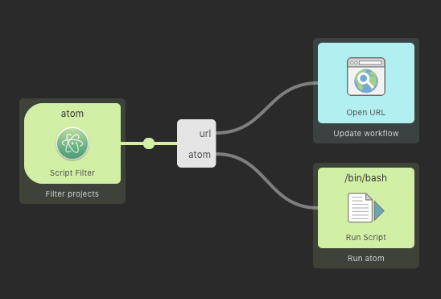

# Updates

If your workflow has been published on NPM or Packal, Hugo can automatically notifiy the user if there is an update available.

There are two ways to notify the user of an available update, with a notification and with an item on the bottom of the list. You're free to choose either one or both. If you disable both methods, you effectively disable checking for updates.

### Update item option

When the item is activated, it will set a variable named `task` (`{var:task}` in Alfred) with the value `wfUpdate`. The argument is set to the URL where the update can be found, either on Packal or NPM depending on `updateSource`. You can link the output to an [Open URL](https://www.alfredapp.com/help/workflows/actions/open-url/) action so a browser opens when the user selects the update item.



### Examples

#### Defaults

```js
import { Hugo } from "alfred-hugo";

const hugo = new Hugo({
    checkUpdates: true, // Check for updates!
    updateInterval: moment.duration(1, "day"), // Check for updates once a day
    updateItem: true, // Show an item on the bottom of the list
    updateNotification: true, // Show a notification
    updateSource: "npm" // Check NPM for updates
});
```

#### Disable updates

```js
import { Hugo } from "alfred-hugo";

const hugo = new Hugo({
    checkUpdates: false
});

// Or (but not recommended)

const hugo = new Hugo({
    updateItem: false,
    updateNotification: false
});
```

